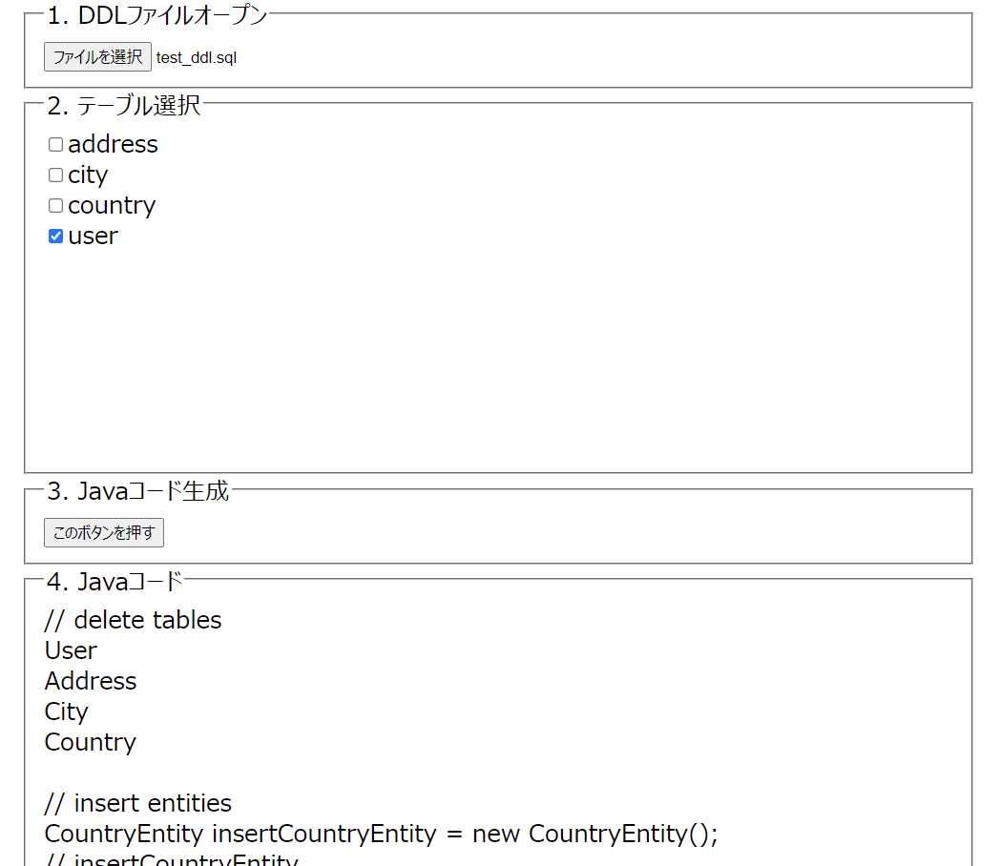

# DDL TOOL

This is a tool to parse DDL file of MySQL.
It generates code that can be used to test your program while considering foreign key constraints into account.

It generates Java code that can be used to delete and insert records.
The output code can be changed by modifying the `genDeleteTableCode` function and `genInsertJavaCode` function.

## Usage
GitHub Pages↓  
[https://kkmtyyz.github.io/ddl-tool/](https://kkmtyyz.github.io/ddl-tool/)

mple, if you open `test_ddl.sql` and check the `user` table, the following code will be output.



output:
```
// delete tables
User
Address
City
Country

// insert entities
CountryEntity insertCountryEntity = new CountryEntity();
// insertCountryEntity

CityEntity insertCityEntity = new CityEntity();
insertCityEntity.setCountryId(insertCountryEntity.getId());
// insertCityEntity

AddressEntity insertAddressEntity = new AddressEntity();
insertAddressEntity.setCityId(insertCityEntity.getId());
// insertAddressEntity

UserEntity insertUserEntity = new UserEntity();
insertUserEntity.setAddressId(insertAddressEntity.getId());
// insertUserEntity
```
